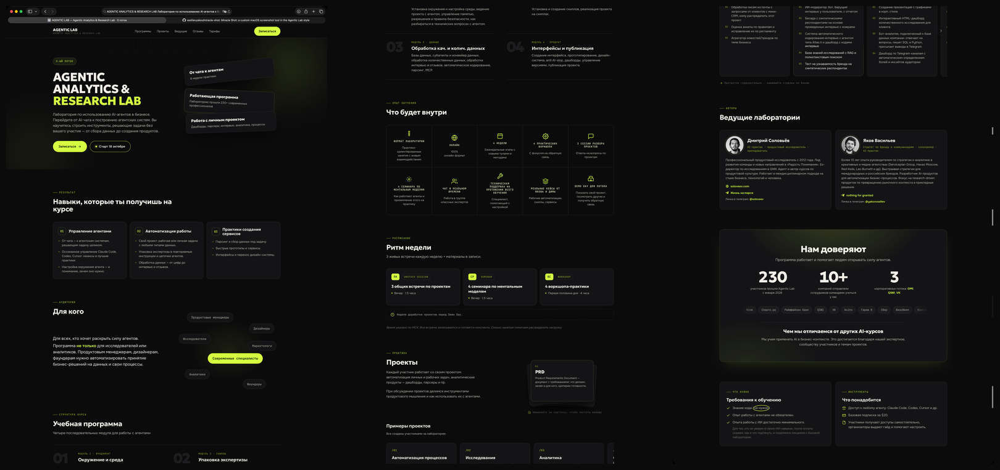
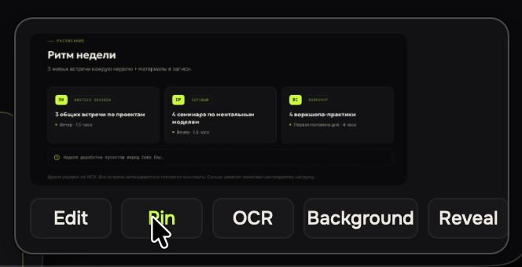
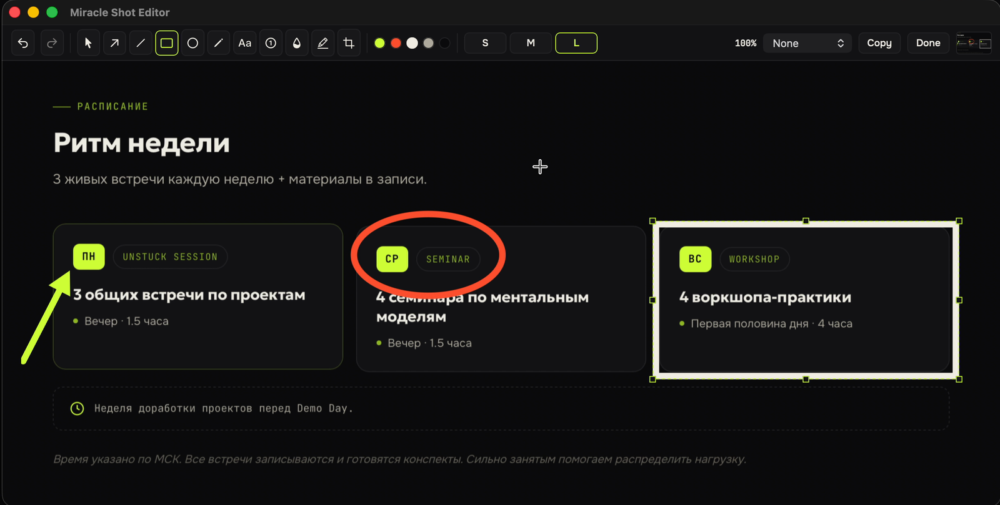
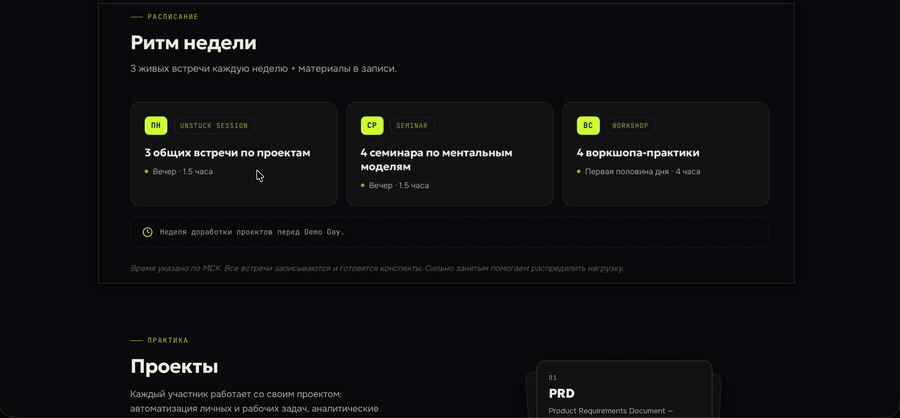
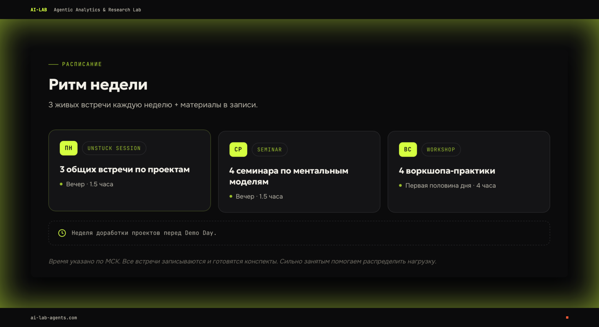

# Miracle Shot

[Русская версия](README.ru.md)

Miracle Shot is a native macOS screenshot tool: hotkeys, quick preview, annotation editor, branded backgrounds, pin, OCR and scrolling capture. Written in Swift 6 with AppKit, built with SwiftPM, covered by 400+ XCTest tests. No subscription, no cloud, no Electron.

It was designed and built in two days (2026-09-14 and 2026-09-15) by a product person working with Claude Code: one orchestrating agent wrote the design and the plans, a fleet of subagents implemented the tasks test-first, other subagents reviewed them, and the human tested every build and decided what to do next. The whole paper trail is in the repository, which makes it a study object as much as a tool. See [How it was made](#how-it-was-made).


## What you get

| | |
|---|---|
| **Capture** | area with a magnifier and window snapping, window, full screen, scrolling window (stitched into one tall image) |
| **Quick preview** | floats in the corner after every capture; buttons Edit, Pin, OCR, Background, Reveal; drag the thumbnail into any app |
| **Editor** | arrow, line, rectangle, ellipse, freehand, text, numbered steps, blur and pixelate, highlighter, crop; undo/redo, zoom and pan; Done puts the result on the clipboard, into the file and into the history |
| **Backgrounds** | five presets in the Agentic Lab palette (Lab Dark, Lime, Bone, Coral, Lab Brand with header and footer), OKLab gradients with dithering, padding and shadow in percent of the image; your own presets as JSON |
| **Pin** | the capture floats above every window; drag, zoom, opacity, Esc or double click to close |
| **OCR** | Vision, Russian and English, text goes to the clipboard |
| **Scrolling capture** | pick a window, the app scrolls it (Accessibility) or you scroll by hand; the frames are stitched in either direction, pinned headers and footers are kept once |
| **Chrome** | menu bar item, history of the last 50 captures, settings for hotkeys, folder, file name template and preview timeout |

Every capture also lands on the clipboard and in `~/Pictures/Miracle Shot` as PNG.

## Install

Requirements: macOS 14 or newer, Apple silicon or Intel.

1. Download `Miracle-Shot.zip` from the [latest release](https://github.com/vasilievyakov/miracle-shot/releases/latest), unzip, move `Miracle Shot.app` to Applications.
2. First launch: right-click the app and choose Open (the build is signed with a local certificate, not notarized by Apple, so Gatekeeper asks once).
3. Grant **Screen Recording** when macOS asks (System Settings > Privacy & Security). Without it nothing can be captured.
4. Optional: grant **Accessibility** for automatic scrolling in scrolling capture. Without it the app asks you to scroll by hand.

The app lives in the menu bar as `MS`; there is no Dock icon.

Building from source needs Xcode 26 (for the Swift 6 toolchain and XCTest):

```bash
git clone https://github.com/vasilievyakov/miracle-shot.git
cd miracle-shot
swift test                 # 400+ tests, about 15 s
scripts/build-app.sh       # build/Miracle Shot.app, icon rendered by scripts/make-icon.swift
open "build/Miracle Shot.app"
```

`scripts/make-signing-cert.sh` creates a local signing identity so macOS keeps the Screen Recording permission across rebuilds (an ad-hoc signature loses it every time).


## Everyday use

| Hotkey | Action |
|---|---|
| shift+cmd+1 | Capture area: drag a rectangle, or click a window to take it whole; the magnifier shows pixels under the cursor, edges snap to windows |
| shift+cmd+2 | Capture window: hover and click |
| shift+cmd+0 | Capture the full screen under the cursor |
| shift+cmd+3 | Capture scrolling window: click a window, then either watch it scroll or scroll it yourself and press Return; Esc stops |
| Esc | Cancel any selection |

All four are configurable in Settings (cmd+, from the menu).


The result of that capture, a 3116 by 13368 pixel page, cut into three columns to fit here:



The preview panel stays for six seconds (hover to keep it):

| Button | What happens |
|---|---|
| Edit | Opens the editor |
| Pin | Pins the capture above all windows |
| OCR | Recognizes the text and copies it; a notification shows the first lines |
| Background | Menu of presets; the framed image replaces the capture (clipboard, file, history) |
| Reveal | Shows the file in Finder |
| Drag the thumbnail | Drops the PNG into any app |



Editor keys: `V` select, `A` arrow, `L` line, `R` rectangle, `O` ellipse, `P` pen, `T` text, `N` numbered step, `B` blur, `H` highlighter, `C` crop; `Delete` removes the selection; `cmd+Z` / `shift+cmd+Z` undo and redo; `cmd+=` / `cmd+-` zoom, `cmd+0` fit, `cmd+1` 100 percent, pinch and cmd+wheel zoom under the cursor; `cmd+C` copies the result; `Done` exports. Colors are the palette only: bone, lime, coral, ink.



Pin keys: `+` / `-` zoom, `]` / `[` opacity, `0` reset, wheel zooms, option+wheel changes opacity, Esc or double click closes.



Background presets are JSON files. The built-in ones are in `Sources/MiracleShotCore/Resources/presets/`; put your own into `~/Library/Application Support/Miracle Shot/presets/` and they appear in the menu.



## Where the code is

Three SwiftPM targets, one rule: everything that can be tested without a window lives in Core.

```
Sources/
  MiracleShotCore/        pure logic, no AppKit: Foundation, CoreGraphics, CoreText, CoreImage
    Capture/              Capture model, CaptureState machine
    Selection/            SelectionGeometry (snapping, magnifier, window under point), WindowInfo
    Editor/               Annotation, Document, EditorSession (the editor as a pure state machine),
                          AnnotationRenderer, hit testing, handles, UndoStack, EditorZoom
    Background/           BackgroundPreset (JSON), BackgroundRenderer, preset library
    Brand/                BrandPalette (the only place with hex colors), OKLab, CoreTypeface
    Scroll/               FrameDiff, ImageStitcher
    OCR/ Pin/ Preview/    OCRResult and the Vision mapping, PinTransform, PreviewTiming
    Settings/ Storage/    Settings, hotkeys, NamingTemplate, HistoryIndex, JSONStore
    Resources/            presets/*.json, fonts (Onest, JetBrains Mono, Geologica, OFL)
  MiracleShotUI/          AppKit: menu bar, overlay, preview panel, editor window, pin panel, services
    Coordinator/          CaptureCoordinator: the only owner of CaptureState, talks to services via protocols
    Services/             ScreenCaptureKit capture, clipboard, files, OCR (Vision), scrolling capture, window list
    Selection/ Preview/ Editor/ Pin/ Scroll/ Toast/ Settings/ Hotkeys/
  MiracleShotApp/         main.swift
Tests/
  MiracleShotCoreTests/   geometry, state machines, renderers, stitcher (synthetic pages and a real corpus)
  MiracleShotAppTests/    coordinator with fake services, shortcuts, smoke tests of the panels
docs/plans/               the design document and the four phase plans, task by task
docs/media/               screenshots and screencasts for this README; tests.tape is a VHS script
scripts/                  build-app.sh, make-icon.swift, make-signing-cert.sh, fetch-fonts.sh, test-corpus.sh
```

Numbers at the time of writing: about 7,000 lines of source, 4,500 lines of tests, 411 tests, 160+ commits.

## How it was made

This is the part worth reading if you build software with agents.

**Roles.** The human (Yakov) owned the direction: what to build, what to cut, what is good enough, what looks wrong. Claude Code with Opus 5 was the orchestrator: it interviewed him, wrote the design, ran the reviews, wrote the plans, dispatched the work, merged the branches, rebuilt the app and read the logs. Sonnet subagents wrote the code and the tests, and other Sonnet subagents reviewed them. Nobody typed Swift by hand.

**Day one.**

1. *Brainstorming* (`superpowers:brainstorming`): questions one at a time, then the design in sections that the human confirmed. Result: [docs/plans/2026-09-14-miracle-shot-design.md](docs/plans/2026-09-14-miracle-shot-design.md), including the decisions and why (section 8): native Swift rather than Tauri or Electron, SwiftPM without an Xcode project so subagents can build from the terminal, Carbon hotkeys that need no Accessibility permission, one renderer for screen and export, logic in Core behind service protocols so the busiest part of the system stays testable.
2. *Board of directors*: five independent review lenses (product, first principles, developer experience, architecture and verifiability, design) run in parallel over the design, synthesized by the architecture lens. The design went to v2 with their corrections: a first milestone that works end to end (hotkey, area, clipboard) before anything parallel starts, a pure `CaptureCoordinator` with fakes, a real-capture corpus as the exit criterion for the stitcher.
3. *Plans* (`superpowers:writing-plans`): [phase 1](docs/plans/2026-09-14-miracle-shot-phase1.md) in 18 tasks, each with the failing test to write, the minimal code, the command to run, the expected output and the commit. Tasks are ordered topologically and grouped into waves that can run in parallel.
4. *Execution* (`superpowers:subagent-driven-development`): for every task a fresh Sonnet implementer gets the full task text and the context it needs, works in its own git worktree (`~/miracle-shot-wt/task-N`, branch `task/N-slug`), writes tests first, commits. Then a reviewer subagent checks spec compliance and code quality against the runtime, not the report. The orchestrator applies small review fixes itself, dispatches the implementer again for large ones, merges with `--no-ff`, and every few tasks rebuilds the app and shows it to the human.

Phase 1 shipped that evening: hotkeys, overlay with magnifier and window snapping, preview, history, settings, menu bar.

**Day two.** Phase 2a: background presets, brand fonts and the icon; the human asked for high-quality gradients ("make all backgrounds gradients, high quality") and geometry in percent so a 100-pixel fragment and a 5K screen get the same frame; a fifth branded preset copied from a reference frame. Phase 2b: the annotation editor in 8 tasks, the editor logic as a pure state machine with 51 tests of its own. Phase 3: pin, OCR, scrolling capture; then the real world arrived through screenshots the human sent back, and the stitcher was rewritten around them (see below). The editor got zoom and scrolling because a 2262 by 19870 stitch was unreadable in a window that fits the whole image.

**What the reviews and the real world caught.** A sample, all in the git history:

- The installed system copy of JetBrains Mono shadowed the bundled variable font, so weights were lost; font descriptors are now built from the bundled files, not by family name.
- Bitmaps drawn into a flipped `NSView` land upside down; the canvas flips locally around the target rect.
- Ad-hoc signed builds lose the Screen Recording permission after every rebuild; a local self-signed identity keeps the designated requirement stable.
- Reading `CGContext.data` after the last use of the context can read freed memory in optimized builds; every such read is wrapped in `withExtendedLifetime`.
- A `grep` on test output masked a failing test, and a task was merged red; since then the orchestrator reads the summary line, not a filter.
- The scroll stitcher was written for pages scrolled downwards. Real captures had a user scrolling both ways, a terminal UI that jumps a page on the first wheel event, a Finder window whose translucent chrome shifts by a few levels with whatever is behind it, a "jump to bottom" pill pinned over the content, and a file list whose sparse text on striped rows almost matches when shifted by a whole row. Then the lab's own site added a section of tags that float forever, so no alignment is ever exact and the blank margins between sections match better than the content. The matcher now takes the alignment whose matching rows explain the most detail rather than the closest one, tries all four ways a frame can relate to the page, leaves pinned UI out of the comparison, judges static edges by the median of pairs, waits for reveal animations per band, and the capture side adapts the scroll step to the shift it actually measures. Every one of those rules has a synthetic test and a real capture behind it.
- The Accessibility scroll-area crop (capture only the `AXScrollArea`, no sidebars) was built, worked from a command-line probe, did not work from inside the app, and was removed the same hour because the human preferred the whole window anyway: "I will crop in the editor".

**What it cost.** Two days of one person's attention, most of it testing builds and answering questions. Agents stalled twice when the laptop slept and were resumed with a message.

**What to take from it.** The plans in `docs/plans` are complete enough that another agent can re-implement any task from them; that was the point of writing them that way. The design document records why, not only what. The review step is not optional: most tasks came back with a real defect or a gap that the tests written by the same agent did not catch. And the exit criterion "passes on a corpus of real captures" turned out to be the only one that mattered for the stitcher.

## Agentic Lab

Miracle Shot is a case study from [Agentic Lab](https://ai-lab-agents.com), a laboratory on using AI agents in business, run by Dmitry Soloveev and Yakov Vasiliev. Participants go from chatting with a model to building agent systems that carry a task end to end: their own project, data pipelines, quick services and interfaces, with Claude Code, Codex and Cursor as the daily tools. More than 230 professionals have been through it.

This repository shows one such project in full: how a product person who does not write Swift gets a native macOS app out of agents in two days, what process makes that possible, and where it breaks. Read the plans, run the tests, open the app.

## License

MIT. The bundled typefaces are under the SIL Open Font License, see `Sources/MiracleShotCore/Resources/fonts/`.
