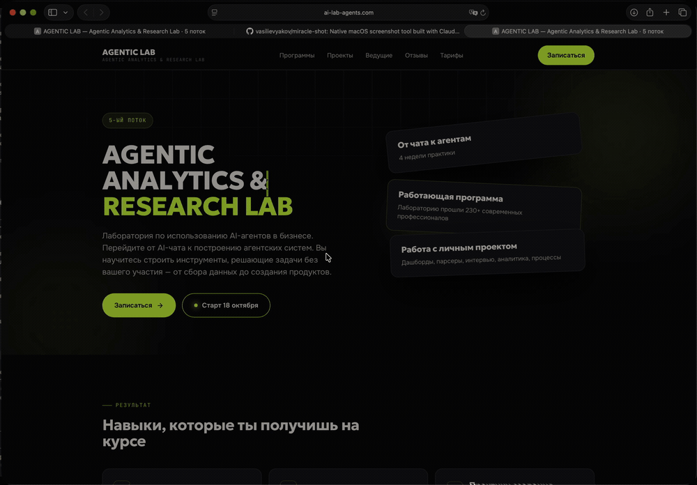
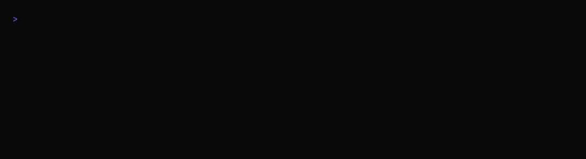

# Miracle Shot

[English version](README.md)

Miracle Shot — нативная утилита скриншотов для macOS: хоткеи, быстрое превью, редактор аннотаций, брендовые подложки, пин, OCR и скроллинг-захват. Swift 6 и AppKit, сборка через SwiftPM, больше 400 тестов XCTest. Без подписки, без облака, без Electron.

Спроектирована и собрана за два дня (14 и 15 сентября 2026) продактом в паре с Claude Code: один агент-оркестратор писал дизайн и планы, субагенты реализовывали задачи через тесты, другие субагенты их ревьюили, а человек проверял каждую сборку и решал, что дальше. Весь бумажный след лежит в репозитории, поэтому это не только инструмент, но и учебный материал. См. [Как это было сделано](#как-это-было-сделано).



## Что внутри

| | |
|---|---|
| **Захват** | область с лупой и прилипанием к окнам, окно, весь экран, прокручиваемое окно (склеивается в одну высокую картинку) |
| **Быстрое превью** | всплывает в углу после каждого захвата; кнопки Edit, Pin, OCR, Background, Reveal; миниатюру можно перетащить в любое приложение |
| **Редактор** | стрелка, линия, прямоугольник, эллипс, карандаш, текст, нумерованные шаги, размытие и пикселизация, маркер, кроп; undo/redo, зум и прокрутка; Done кладет результат в буфер, файл и историю |
| **Подложки** | пять пресетов в палитре Agentic Lab (Lab Dark, Lime, Bone, Coral, Lab Brand с шапкой и подвалом), градиенты в OKLab с дизерингом, отступы и тень в процентах от картинки; свои пресеты в JSON |
| **Пин** | снимок висит поверх всех окон; перетаскивание, масштаб, прозрачность, Esc или двойной клик закрывают |
| **OCR** | Vision, русский и английский, текст в буфер |
| **Скроллинг-захват** | выбираешь окно, приложение прокручивает его само (Accessibility) или ты скроллишь руками; кадры склеиваются в любую сторону, закрепленные шапки и подвалы остаются один раз |
| **Обвязка** | пункт в строке меню, история последних 50 снимков, настройки хоткеев, папки, шаблона имени и таймаута превью |

Каждый снимок сразу попадает в буфер обмена и в `~/Pictures/Miracle Shot` как PNG.

## Установка

Требования: macOS 14 или новее, Apple silicon или Intel.

1. Скачай `Miracle-Shot.zip` из [последнего релиза](https://github.com/vasilievyakov/miracle-shot/releases/latest), распакуй, перенеси `Miracle Shot.app` в Applications.
2. Первый запуск: правый клик по приложению и Open (сборка подписана локальным сертификатом, не нотаризована Apple, поэтому Gatekeeper спросит один раз).
3. Выдай **Screen Recording**, когда macOS попросит (System Settings > Privacy & Security). Без него захват невозможен.
4. По желанию: выдай **Accessibility** для автоматической прокрутки в скроллинг-захвате. Без него приложение попросит скроллить руками.

Приложение живет в строке меню как `MS`, иконки в доке нет.

Сборка из исходников требует Xcode 26 (тулчейн Swift 6 и XCTest):

```bash
git clone https://github.com/vasilievyakov/miracle-shot.git
cd miracle-shot
swift test                 # 400+ тестов, около 15 с
scripts/build-app.sh       # build/Miracle Shot.app, иконку рисует scripts/make-icon.swift
open "build/Miracle Shot.app"
```

`scripts/make-signing-cert.sh` создает локальную подпись, чтобы macOS не забывала разрешение Screen Recording после каждой пересборки (ad-hoc подпись теряет его каждый раз).



## Как пользоваться

| Хоткей | Действие |
|---|---|
| shift+cmd+1 | Область: растяни прямоугольник или кликни по окну, чтобы взять его целиком; лупа показывает пиксели под курсором, края прилипают к окнам |
| shift+cmd+2 | Окно: наведи и кликни |
| shift+cmd+0 | Весь экран под курсором |
| shift+cmd+3 | Прокручиваемое окно: кликни по окну, дальше либо смотри, как оно скроллится само, либо скролль руками и нажми Return; Esc останавливает |
| Esc | Отменить любое выделение |

Все четыре меняются в настройках (cmd+, из меню).

Превью висит шесть секунд (наведение курсора останавливает таймер):

| Кнопка | Что происходит |
|---|---|
| Edit | Открывает редактор |
| Pin | Прикрепляет снимок поверх всех окон |
| OCR | Распознает текст и копирует его; уведомление показывает первые строки |
| Background | Меню пресетов; картинка с подложкой заменяет снимок (буфер, файл, история) |
| Reveal | Показывает файл в Finder |
| Перетащить миниатюру | Бросает PNG в любое приложение |

Клавиши редактора: `V` выделение, `A` стрелка, `L` линия, `R` прямоугольник, `O` эллипс, `P` карандаш, `T` текст, `N` нумерованный шаг, `B` размытие, `H` маркер, `C` кроп; `Delete` удаляет выделенное; `cmd+Z` / `shift+cmd+Z` undo и redo; `cmd+=` / `cmd+-` зум, `cmd+0` вписать, `cmd+1` 100 процентов, пинч и cmd+колесо зумят под курсором; `cmd+C` копирует результат; `Done` экспортирует. Цвета только из палитры: bone, lime, coral, ink.

Клавиши пина: `+` / `-` масштаб, `]` / `[` прозрачность, `0` сброс, колесо масштабирует, option+колесо меняет прозрачность, Esc или двойной клик закрывают.

Пресеты подложек — JSON-файлы. Встроенные лежат в `Sources/MiracleShotCore/Resources/presets/`; свои положи в `~/Library/Application Support/Miracle Shot/presets/`, и они появятся в меню.

## Где код

Три таргета SwiftPM и одно правило: все, что можно проверить без окна, живет в Core.

```
Sources/
  MiracleShotCore/        чистая логика без AppKit: Foundation, CoreGraphics, CoreText, CoreImage
    Capture/              модель Capture, автомат CaptureState
    Selection/            SelectionGeometry (прилипание, лупа, окно под точкой), WindowInfo
    Editor/               Annotation, Document, EditorSession (редактор как чистый автомат),
                          AnnotationRenderer, хит-тест, ручки, UndoStack, EditorZoom
    Background/           BackgroundPreset (JSON), BackgroundRenderer, библиотека пресетов
    Brand/                BrandPalette (единственное место с hex-цветами), OKLab, CoreTypeface
    Scroll/               FrameDiff, ImageStitcher
    OCR/ Pin/ Preview/    OCRResult и маппинг Vision, PinTransform, PreviewTiming
    Settings/ Storage/    Settings, хоткеи, NamingTemplate, HistoryIndex, JSONStore
    Resources/            presets/*.json, шрифты (Onest, JetBrains Mono, Geologica, OFL)
  MiracleShotUI/          AppKit: строка меню, оверлей, превью, окно редактора, пин, сервисы
    Coordinator/          CaptureCoordinator: единственный владелец CaptureState, сервисы только через протоколы
    Services/             захват через ScreenCaptureKit, буфер, файлы, OCR (Vision), скроллинг-захват, список окон
    Selection/ Preview/ Editor/ Pin/ Scroll/ Toast/ Settings/ Hotkeys/
  MiracleShotApp/         main.swift
Tests/
  MiracleShotCoreTests/   геометрия, автоматы, рендереры, склейщик (синтетические страницы и реальный корпус)
  MiracleShotAppTests/    координатор с фейковыми сервисами, шорткаты, smoke-тесты панелей
docs/plans/               дизайн-документ и четыре плана фаз, задача за задачей
docs/media/               скриншоты и скринкасты для этого README; tests.tape — сценарий VHS
scripts/                  build-app.sh, make-icon.swift, make-signing-cert.sh, fetch-fonts.sh, test-corpus.sh
```

Цифры на момент написания: около 7 000 строк кода, 4 500 строк тестов, 407 тестов, 150+ коммитов.

## Как это было сделано

Эту часть стоит прочитать, если вы делаете софт с агентами.

**Роли.** Человек (Яков) владел направлением: что строить, что вырезать, что достаточно хорошо, что выглядит не так. Claude Code на Opus 5 был оркестратором: расспрашивал, писал дизайн, гонял ревью, писал планы, раздавал работу, сливал ветки, пересобирал приложение и читал логи. Субагенты на Sonnet писали код и тесты, другие субагенты на Sonnet их ревьюили. Swift руками не писал никто.

**День первый.**

1. *Брейншторм* (`superpowers:brainstorming`): вопросы по одному, потом дизайн по секциям, каждую человек подтверждал. Результат: [docs/plans/2026-09-14-miracle-shot-design.md](docs/plans/2026-09-14-miracle-shot-design.md), включая решения и почему (раздел 8): нативный Swift вместо Tauri или Electron, SwiftPM без проекта Xcode, чтобы субагенты собирали из терминала, хоткеи через Carbon без разрешения Accessibility, один рендерер для экрана и экспорта, логика в Core за протоколами сервисов, чтобы самая нагруженная часть системы оставалась тестируемой.
2. *Совет директоров*: пять независимых линз ревью (продукт, первые принципы, developer experience, архитектура и верифицируемость, дизайн) параллельно смотрят на дизайн, синтез ведет архитектурная линза. Дизайн ушел в v2 с их поправками: первая веха, которая работает насквозь (хоткей, область, буфер) до любых параллельных задач, чистый `CaptureCoordinator` с фейками, корпус реальных захватов как критерий закрытия склейщика.
3. *Планы* (`superpowers:writing-plans`): [фаза 1](docs/plans/2026-09-14-miracle-shot-phase1.md) в 18 задачах, в каждой падающий тест, минимальный код, команда, ожидаемый вывод и коммит. Задачи упорядочены топологически и собраны в волны, которые идут параллельно.
4. *Исполнение* (`superpowers:subagent-driven-development`): на каждую задачу свежий исполнитель на Sonnet получает полный текст задачи и нужный контекст, работает в своем git worktree (`~/miracle-shot-wt/task-N`, ветка `task/N-slug`), сначала тесты, потом коммит. Затем субагент-ревьюер проверяет соответствие спеке и качество кода, глядя в код и рантайм, а не в отчет исполнителя. Мелкие правки по ревью оркестратор вносит сам, крупные возвращает исполнителю, сливает через `--no-ff`, и каждые несколько задач пересобирает приложение и показывает человеку.

Фаза 1 вышла в тот же вечер: хоткеи, оверлей с лупой и прилипанием к окнам, превью, история, настройки, строка меню.

**День второй.** Фаза 2a: пресеты подложек, брендовые шрифты и иконка; человек попросил качественные градиенты («сделай все бэкграунды градиентом с высоким качеством») и геометрию в процентах, чтобы фрагмент в 100 пикселей и экран 5K получали одинаковую рамку; пятый брендовый пресет срисован с референса. Фаза 2b: редактор аннотаций в 8 задачах, логика редактора как чистый автомат с 51 собственным тестом. Фаза 3: пин, OCR, скроллинг-захват; потом через скриншоты, которые присылал человек, пришла реальность, и склейщик переписали под нее (ниже). Редактор получил зум и прокрутку, потому что склейка 2262 на 19870 в окне, вписывающем картинку целиком, была нечитаема.

**Что поймали ревью и реальность.** Выборка, все есть в истории git:

- Установленная в системе копия JetBrains Mono перекрывала шрифт из бандла, терялись начертания; дескрипторы шрифтов теперь строятся из файлов бандла, а не по имени семейства.
- Битмапы, нарисованные во флипнутый `NSView`, ложатся вверх ногами; канвас переворачивает локально вокруг целевого прямоугольника.
- Сборки с ad-hoc подписью теряют разрешение Screen Recording после каждой пересборки; локальная самоподписанная identity держит designated requirement стабильным.
- Чтение `CGContext.data` после последнего обращения к контексту может читать освобожденную память в оптимизированной сборке; каждое такое чтение обернуто в `withExtendedLifetime`.
- `grep` по выводу тестов замаскировал падающий тест, и задача ушла в merge красной; с тех пор оркестратор читает итоговую строку, а не фильтр.
- Склейщик писался для страниц, которые листают вниз. В реальных захватах пользователь листал в обе стороны, терминальный UI прыгал на страницу от первого события колеса, полупрозрачная рамка Finder менялась на несколько уровней вместе с тем, что за окном, плашка «jump to bottom» висела поверх контента, а список файлов с разреженным текстом на полосатых строках почти совпадал при сдвиге на целую строку. Теперь матчер берет самое близкое перекрытие, а не первое под порогом, пробует все четыре способа, которыми кадр может относиться к странице, выводит закрепленные элементы из сравнения, судит о статичных краях по медиане пар, а захват подстраивает шаг прокрутки под реально измеренный сдвиг.
- Обрезка кадров до области прокрутки через Accessibility (только `AXScrollArea`, без сайдбаров) была написана, работала из консольной утилиты, не работала внутри приложения и была удалена через час, потому что человек и так предпочел окно целиком: «обрежу в редакторе».

**Что это стоило.** Два дня внимания одного человека, большая часть ушла на проверку сборок и ответы на вопросы. Агенты дважды зависали, когда ноутбук уходил в сон, и возобновлялись одним сообщением.

**Что забрать.** Планы в `docs/plans` достаточно полны, чтобы другой агент реализовал любую задачу по ним заново; ради этого они так и написаны. Дизайн-документ фиксирует «почему», а не только «что». Ревью не опционально: большинство задач возвращалось с реальным дефектом или пробелом, который тесты того же агента не поймали. А критерий закрытия «проходит на корпусе реальных захватов» оказался единственным, который для склейщика имел значение.

## Agentic Lab

Miracle Shot — кейс из [Agentic Lab](https://ai-lab-agents.com), лаборатории по использованию AI-агентов в бизнесе, которую ведут Дмитрий Соловьев и Яков Васильев. Участники переходят от чата с моделью к агентским системам, которые решают задачу целиком: свой проект, конвейеры данных, быстрые сервисы и интерфейсы, с Claude Code, Codex и Cursor как повседневными инструментами. Через лабораторию прошли больше 230 профессионалов.

Этот репозиторий показывает один такой проект целиком: как продакт, не пишущий на Swift, получает от агентов нативное приложение для macOS за два дня, какой процесс делает это возможным и где он ломается. Читайте планы, гоняйте тесты, открывайте приложение.

## Лицензия

MIT. Шрифты в бандле под SIL Open Font License, см. `Sources/MiracleShotCore/Resources/fonts/`.
